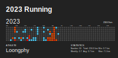

#### Hi there 👋

生命不息，折腾不止

<code></code>
<code></code>
<code></code>
<code></code>
<code></code>

<picture>
  <source media="(prefers-color-scheme: dark)" srcset="github-snake-dark.svg" />
  <source media="(prefers-color-scheme: light)" srcset="github-snake.svg" />
  
</picture>

|  |  |
| ------------------------------------------------------------------------------------------------------------------------------------------------------------------------------------------------------------------------------------- | ------------------------------------------------------------------------------------------------------------------------------------------------------------------------------------------ |

#### 📚 最近在读

<!-- weread starts -->
- 翦商：周之变与华夏新生
- 操作系统导论
- 我的精神家园
- 伯恩斯焦虑自助疗法

 
  
上月数据

  
  

<!-- weread ends -->

#### 📑 最新博客

<!-- blog starts -->
* <a href=https://blog.loongphy.com/posts/weekly-review-20230604/ target='_blank'>周报#7 耳朵伤病、被 uni-app 折磨</a> - 2023-06-04
* <a href=https://blog.loongphy.com/posts/chatgpt-prompt-engineering-for-developers-notes-20230430/ target='_blank'>ChatGPT Prompt Engineering for Developers 笔记</a> - 2023-04-30
* <a href=https://blog.loongphy.com/posts/request-access-to-azure-openai-service-20230425/ target='_blank'>Azure OpenAI Service 申请流程和注意事项</a> - 2023-04-25
* <a href=https://blog.loongphy.com/posts/weekly-review-20230416/ target='_blank'>周报#6 原生家庭的影响</a> - 2023-04-16
* <a href=https://blog.loongphy.com/posts/weekly-review-20230409/ target='_blank'>周报#5 AI时代，写作的意义</a> - 2023-04-09
<!-- blog ends -->

#### 🏃‍♂️ 跑步

